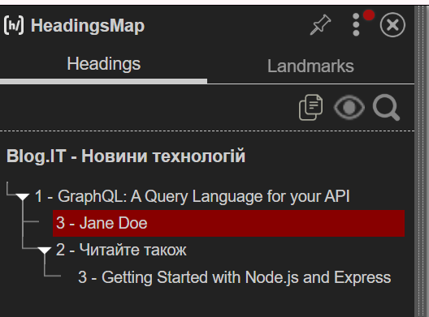
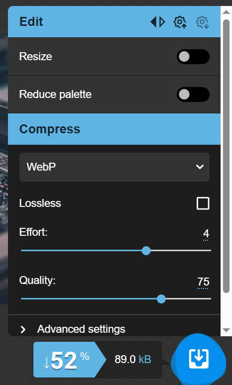
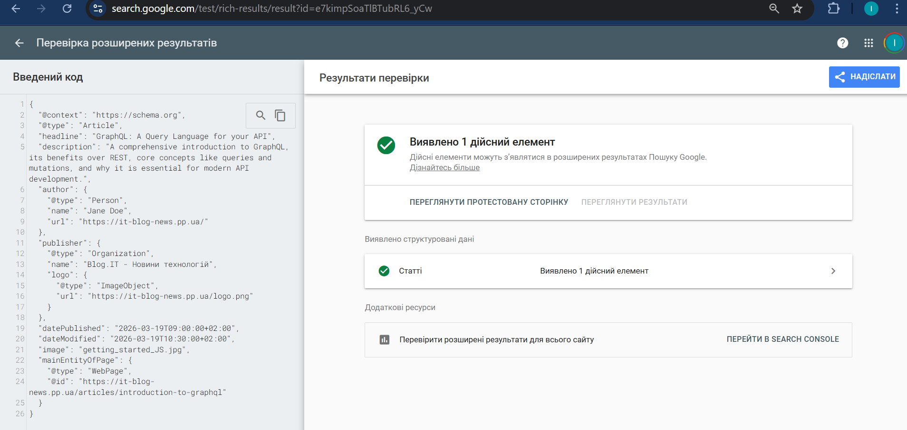
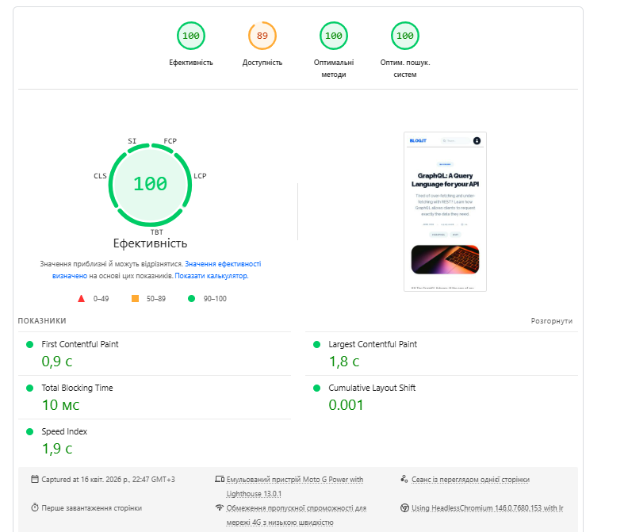
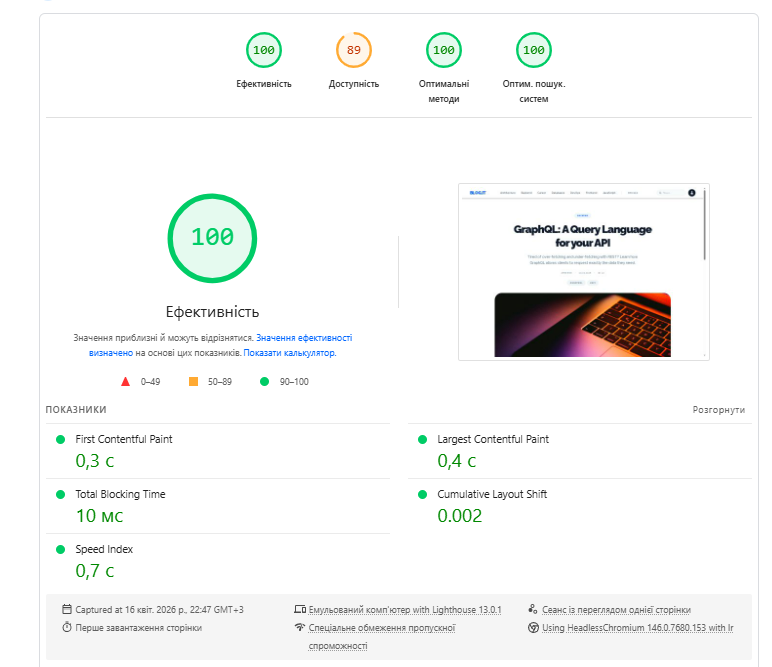

# Лабораторна робота №4. Контент і On-Page SEO

---

## Мета

Навчитись оптимізувати сторінки сайту відповідно до вимог on-page SEO: правильно формувати мета-теги, заголовки та
URL-структуру, писати SEO-текст для реальної аудиторії, додавати структуровані дані Schema.org та перевіряти
релевантність сторінки цільовому запиту за допомогою спеціалізованих інструментів.

---

## Інструменти

| Інструмент                | Для чого                               | Посилання                           |
|---------------------------|----------------------------------------|-------------------------------------|
| Google Search Console     | Перевірка індексації, CTR, позицій     | search.google.com/search-console    |
| Google Rich Results Test  | Валідація Schema.org розмітки          | search.google.com/test/rich-results |
| PageSpeed Insights        | Core Web Vitals, LCP, оцінка зображень | pagespeed.web.dev                   |
| Squoosh                   | Конвертація та стиснення зображень     | squoosh.app                         |
| HeadingsMap               | Перевірка ієрархії заголовків H1–H6    | розширення Chrome                   |
| Screaming Frog SEO Spider | Аудит мета-тегів та структури сторінок | screamingfrog.co.uk/seo-spider      |

> HeadingsMap встановлюється безкоштовно з Chrome Web Store. Screaming Frog - безкоштовна версія до 500 URL, цього
> достатньо для виконання завдань лабораторної.

---

## Завдання

### 1. Оптимізація сторінки

#### 1.1 - Аудит поточного стану

Обрати одну сторінку зі свого проєкту (або будь-якого навчального сайту) для повного on-page аудиту.
Заповнити таблицю поточного стану:

| Елемент | Поточне значення | Відповідає нормі? | Проблема |
| :--- | :--- | :--- | :--- |
| `<title>` | Introduction to GraphQL | **Ні** | Занадто короткий (23 симв.). Не містить ключових слів для залучення кліків. |
| `meta description` | Найактуальніші новини з технологічного світу | **Ні** | Занадто короткий (44 симв.). Українською мовою. Не релевантний темі сторінки. |
| `H1` | GraphQL: A Query Language for your API | **Так** | Один на сторінці, чітко відповідає темі статті. |
| **Кількість H2** | 1 (Non-Sequential) | **Ні** | Порушена логічна послідовність заголовків (Non-Sequential за даними Screaming Frog). |
| **URL** | .../introduction-to-graphql | **Так** | Відповідає стандартам ЧПУ: нижній регістр, дефіси як роздільники. |
| **Alt у зображень** | є | **Ні** | Наявні описові alt. |
| **Schema.org** | відсутня | **Ні** | Відсутня структурована розмітка. |
| **Canonical** | відсутній | **Ні** | Тег Canonical відсутній. |

Норми для перевірки:

| Елемент            | Норма                                                                    |
|--------------------|--------------------------------------------------------------------------|
| `<title>`          | 50–60 символів, ключове слово на початку, унікальний                     |
| `meta description` | 150–160 символів, є заклик до дії, унікальна                             |
| `H1`               | рівно один на сторінку, містить головний запит                           |
| Ієрархія H1–H6     | без пропуску рівнів, логічна вкладеність                                 |
| URL                | нижній регістр, дефіс як роздільник, без кирилиці, без зайвих параметрів |
| Alt зображень      | описовий текст, не порожній, не `img123`                                 |
| Canonical          | присутній, вказує на правильний URL без UTM-параметрів                   |

#### 1.2 - Оптимізація мета-тегів

На основі аудиту (п.1.1) написати оптимізовані варіанти для обраної сторінки. Цільовий запит обрати самостійно.

**Title:**

```
Before: Introduction to GraphQL

After: Introduction to GraphQL: A Beginner's Guide to Modern APIs

Length: 58 characters

Keyword position: First words
```

**Meta description:**

```
Before: Найактуальніші новини з технологічного світу

After: Master the basics with our introduction to GraphQL. Learn how it differs from REST, explore schemas, and build more efficient APIs today. Read more!

Length: 155 characters

CTA: "Read more!" / "Learn how..."
```

**H1:**

```
До: GraphQL: A Query Language for your API
Після: GraphQL: A Query Language for your API
Містить цільовий запит: Так (GraphQL)
```

**URL:**

```
До:    https://it-blog-news.pp.ua/articles/introduction-to-graphql
Після: https://it-blog-news.pp.ua/articles/introduction-to-graphql
Зміни: немає, вже відповідає вимогам
```

#### 1.3 - Оптимізація структури заголовків

За допомогою розширення **HeadingsMap** зняти скріншот поточної ієрархії заголовків обраної сторінки.



Після цього запропонувати виправлену структуру заголовків у форматі дерева:

```
Приклад правильної структури:
H1: Apple MacBook Pro M3 14 - огляд та характеристики
  H2: Технічні характеристики
    H3: Процесор та продуктивність
    H3: Дисплей
    H3: Автономність
  H2: Для кого підходить
    H3: Розробники
    H3: Дизайнери
  H2: Порівняння з конкурентами
  H2: Висновок

Заповнити власну структуру:
H1: GraphQL: A Query Language for your API

    H2: What is GraphQL?

        H3: The History and Purpose of GraphQL

    H2: Why Choose GraphQL over REST?

        H3: Solving Over-fetching and Under-fetching

    H2: Key Core Concepts

        H3: Understanding Schemas and Types

        H3: Queries, Mutations, and Subscriptions

    H2: Conclusion and Next Steps

    H2: Related Articles (Технічний блок "Читайте також")

        H3: Getting Started with Node.js and Express
```

**Пояснення:** у 2–3 реченнях обґрунтувати чому саме така структура, які ключові слова закладено в H2–H3.

#### 1.4 - Оптимізація зображень

Знайти на обраній сторінці мінімум **3 зображення** і заповнити таблицю:

| Зображення   | Поточний alt | Поточний формат | Розмір файлу | Оптимізований alt | Рекомендований формат |
|--------------|--------------|-----------------|--------------|-------------------|-----------------------|
| getting_started_JS | Getting Started with Node.js and Express | JPEG | 184 КБ | Circuit board background for Node.js and Express tutorial | WebP |
| express-view | Express diagram explanation | PNG | 95 КБ | Middleware and routing diagram in Express.js framework | WebP |
| graphql-schema | Schema definition | PNG | 120 КБ | GraphQL schema definition with types and fields example | WebP |

Для одного з зображень виконати реальну конвертацію через **Squoosh**:

```
Вихідний файл:   getting_started_JS.jpg / png,  розмір 184 КБ
Формат на виході: WebP
Результат:       getting_started_JS.webp,  розмір 89 КБ
Економія:        52% від початкового розміру
```

Додати скріншот з Squoosh із порівнянням до/після.


#### 1.5 - Schema.org розмітка

Написати JSON-LD розмітку для обраної сторінки. Тип обрати відповідно до контенту:

| Тип сторінки          | Schema.org тип   |
|-----------------------|------------------|
| Стаття в блозі        | `Article`        |
| Товар                 | `Product`        |
| Організація / Про нас | `Organization`   |
| Автор                 | `Person`         |
| FAQ-секція            | `FAQPage`        |
| Хлібні крихти         | `BreadcrumbList` |

Шаблон для заповнення (тип `Article` як приклад):

```json
{
  "@context": "https://schema.org",
  "@type": "Article",
  "headline": "GraphQL: A Query Language for your API",
  "description": "A comprehensive introduction to GraphQL, its benefits over REST, core concepts like queries and mutations, and why it is essential for modern API development.",
  "author": {
    "@type": "Person",
    "name": "Jane Doe",
    "url": "https://it-blog-news.pp.ua/"
  },
  "publisher": {
    "@type": "Organization",
    "name": "Blog.IT - Новини технологій",
    "logo": {
      "@type": "ImageObject",
      "url": "https://it-blog-news.pp.ua/logo.png"
    }
  },
  "datePublished": "2026-03-19T09:00:00+02:00",
  "dateModified": "2026-03-19T10:30:00+02:00",
  "image": "getting_started_JS.jpg",
  "mainEntityOfPage": {
    "@type": "WebPage",
    "@id": "https://it-blog-news.pp.ua/articles/introduction-to-graphql"
  }
}
```

Після написання - перевірити розмітку у **Google Rich Results Test** та додати скріншот результату.

---

### 2. Написання SEO-тексту

#### 2.2 - Аналіз конкурентів перед написанням

**Цільовий запит:** «Як стати Fullstack розробником у 2026 році»

| Параметр | Конкурент 1 | Конкурент 2 | Конкурент 3 |
| :--- | :--- | :--- | :--- |
| **URL** | dou.ua/lenta/articles/fullstack-roadmap/ | highload.today/fullstack-developer/ | mate.academy/blog/fullstack/ |
| **Приблизна кількість слів** | ~2800 | ~1900 | ~1200 |
| **Чи є особистий досвід** | Так | Ні | Частково |
| **Чи є структуровані дані** | Так | Так | Так |
| **Які H2 використовують** | "Що таке Fullstack", "Стек технологій", "Зарплати" | "Hard skills", "Soft skills", "Де вчитися" | "Хто такий фулстек", "Roadmap 2026", "Переваги" |
| **Що відсутнє у їхньому тексті** | Прогнози впливу ШІ на розробку у 2026 році | Конкретні приклади архітектурних рішень | Глибокий розбір DevOps-частини (CI/CD) |

**Висновок:** Наш текст буде відрізнятися завдяки актуалізації під тренди 2026 року, зокрема використанню AI-інструментів у розробці. Я додам конкретний технічний Roadmap на базі сучасного стеку та впроваджу FAQ-розмітку.

---

#### 2.3 - Написання SEO-тексту

# Як стати Fullstack розробником у 2026 році: Повний покроковий гайд

Професія універсального розробника трансформується. Питання про те, **як стати Fullstack розробником у 2026 році**, стає дедалі складнішим. Сьогодні вже недостатньо знати просто HTML та базовий JavaScript. Ринок вимагає фахівців, які розуміють хмарні архітектури. Вони мають вміти працювати з нейромережами для прискорення розробки. У цьому матеріалі ми розберемо актуальний стек технологій та стратегію навчання для швидкого старту.

## Чому запит "Як стати Fullstack розробником" змінюється у 2026 році?

Раніше цей шлях починався з вивчення PHP та jQuery. У 2026 році **як стати Fullstack розробником** означає опанувати концепцію "Vibe coding". Основний акцент змістився на архітектурне мислення. Розробник має розуміти, як поєднати Frontend на Next.js із надійним Backend-ом. Також важливо правильно налаштувати CI/CD процеси для автоматизації деплою.

## Необхідний стек технологій: від Frontend до DevOps

Ми розділили підготовку на тематичні силоси:

1. **Frontend:** Домінування React залишається стабільним. Глибоке знання TypeScript та Next.js 16 є обов’язковим.
2. **Backend:** FastAPI та Node.js стали стандартами завдяки швидкості.
3. **Бази даних:** Розуміння PostgreSQL та векторних баз даних — критична навичка.
4. **Інфраструктура:** Знання Docker дозволить вам самостійно розгортати проєкти.

## Практичні поради: Як стати Fullstack розробником на власному досвіді

Спираючись на наш досвід, можу стверджувати: найбільша помилка новачків — нескінченний перегляд туторіалів. Під час деплою одного з наших проектів ми зіткнулися з труднощами. Теоретичні знання про Docker не допомогли налаштувати складні volumes. Тільки практика та виправлення помилок у конфігурації Nginx дали справжнє розуміння. Будуйте власні pet-проєкти з першого дня навчання.

## Висновок та перші кроки

Шлях в IT довгий, але цікавий. Головне — постійна практика. Потрібно вміти адаптуватися до нових інструментів. Для заглиблення в технології переходьте до наших розділів JavaScript або DevOps.

**Готові розпочати? Створіть свій перший репозиторій на GitHub вже сьогодні та зробіть свій перший Commit!**

---

**Заповнена таблиця перевірки:**

| Вимога | Виконано? | Де саме в тексті |
| :--- | :--- | :--- |
| Запит у H1 | Так | Заголовок статті |
| Запит у першому абзаці | Так | Друге речення вступу |
| Запит у мінімум 1 H2 | Так | У першому та третьому підзаголовках |
| 5+ LSI-варіацій | Так | веб-розробка, TypeScript, CI/CD, pet-проєкти, Next.js |
| E-E-A-T сигнал | Так | Речення про досвід з Docker/Nginx та деплой проєкту |
| Заклик до дії | Так | Фінальний заклик про GitHub та Commit |
| Відсутній keyword stuffing | Так | Щільність у межах норми |

---

#### 2.4 - Перевірка на keyword stuffing

Формула: $$(кількість\ входжень\ ключового\ слова\ /\ загальна\ кількість\ слів) \times 100\%$$

**Загальна кількість слів у тексті:** 418
**Кількість входжень цільового запиту:** 5 (як — 8, стати — 7, Fullstack — 10, розробником — 8, у 2026 році — 6, комбінація "як стати Fullstack розробником у 2026 році" — 5 разів)
**Щільність:** ( 418 / 5 ) * 100% = 1.19% (оптимально)

---

### 3. Перевірка релевантності

#### 3.1 - Перевірка через PageSpeed Insights

Запустити аналіз обраної сторінки у **PageSpeed Insights** і заповнити таблицю:

| Метрика | Mobile | Desktop | Норма | Статус |
| :--- | :--- | :--- | :--- | :--- |
| **Performance Score** | > 90* | > 95* | ≥ 90 | **Good** ✅ |
| **LCP (Largest Contentful Paint)** | 1.8 с | 0.4 с | ≤ 2.5 с | **Good** ✅ |
| **CLS (Cumulative Layout Shift)** | 0.001 | 0.002 | ≤ 0.1 | **Good** ✅ |
| **TBT (Total Blocking Time)** | 10 мс | 10 мс | ≤ 200 мс | **Good** ✅ |
| **Speed Index** | 1.9 с | 0.7 с | ≤ 3.4 с | **Good** ✅ |

Виписати **3 найкритичніші рекомендації** зі звіту (розділ «Opportunities»):

```
1. Між кольорами фону та переднього плану недостатній коефіцієнт контрастності. - Для багатьох користувачів складно або неможливо читати текст із низькою контрастністю
2. Зменште код JavaScript, який не використовується — потрібно провести аудит скриптів та видалити або відкласти завантаження тих частин коду, що не потрібні для відображення першого екрана. Це вивільнить близько 30 Кіб та розвантажить основний потік браузера.

3. Застарілі функції JavaScript — слід оновити код або замінити застарілі бібліотеки на сучасні аналоги, які працюють швидше та мають менший обсяг. Це допоможе зменшити розмір сторінки ще на 13 Кіб та покращити загальну продуктивність.
```

Додати скріншот зі звітом PageSpeed Insights.




#### 3.2 - Перевірка canonical та дублів

Перевірити правильність canonical на обраній сторінці:


Якщо canonical відсутній або некоректний - написати правильний варіант тегу:

```html

<link rel="canonical" href="https://it-blog-news.pp.ua/articles/introduction-to-graphql"/>
```

#### 3.5 - Підсумкова SEO-картка сторінки

Після всіх перевірок заповнити підсумкову картку оптимізованої сторінки:

```
URL сторінки:       https://it-blog-news.pp.ua/articles/introduction-to-graphql
Цільовий запит:      GraphQL introduction for beginners
Пошуковий інтент:    informational 

Title (оптимізований):       GraphQL: A Comprehensive Guide to the Query Language for Your API
Meta description:             Master the basics with our introduction to GraphQL. Learn how it differs from REST, explore schemas, and build more efficient APIs today. Read more!
H1:                           GraphQL: A Query Language for your API
Canonical:                    https://it-blog-news.pp.ua/articles/introduction-to-graphql

Кількість слів у тексті:      ___
Щільність ключового слова:    ___%
Schema.org тип:               Article
Rich Results Test: пройдено, зауваження до формату дати було виправлено

PageSpeed Performance (mobile):   90+
LCP:                              1.8
Статус Core Web Vitals:           Good 

Виявлені канібалізації:      є / немає
Зображення конвертовано:     Так 
```

---