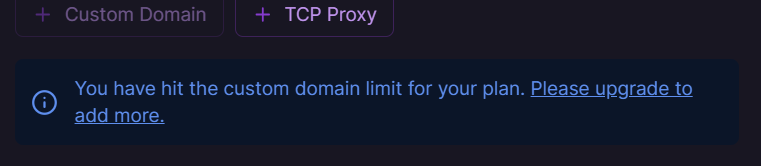
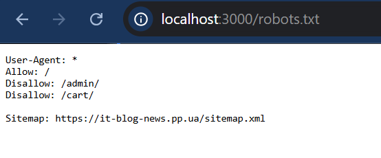
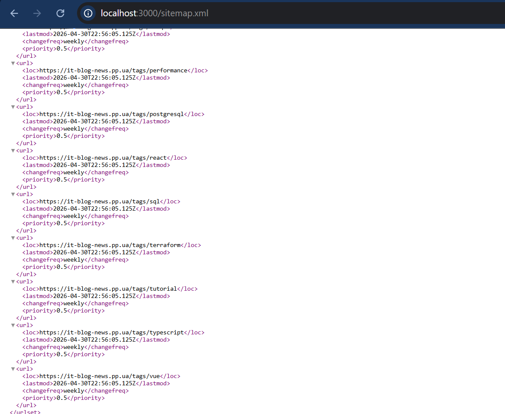
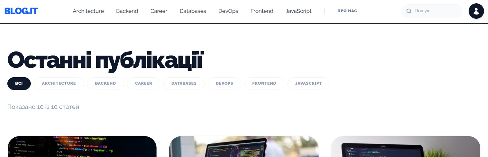
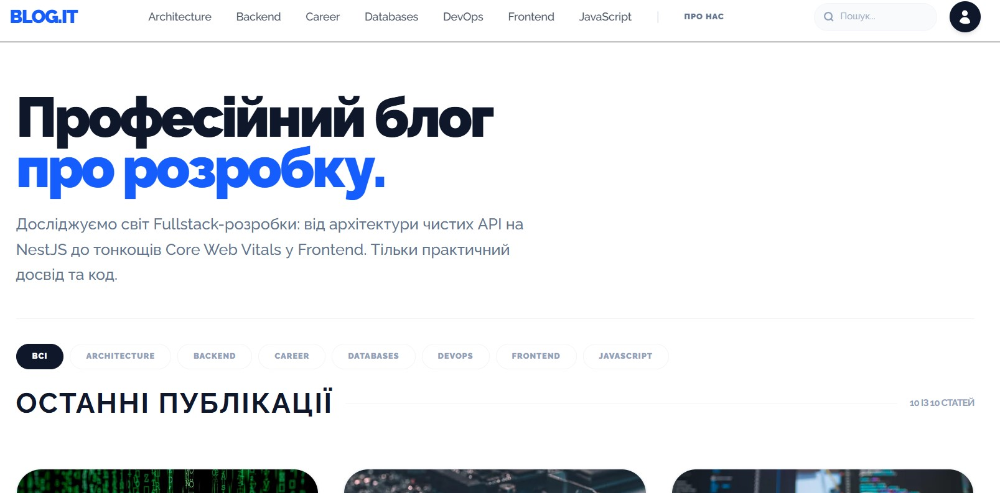
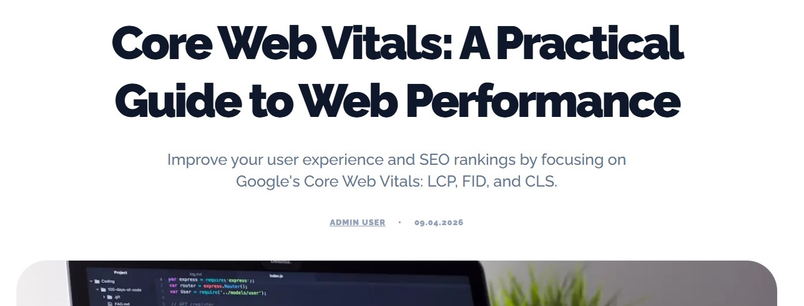
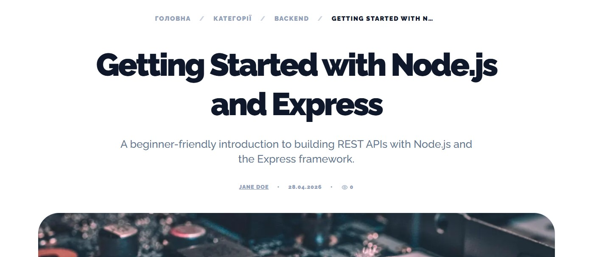
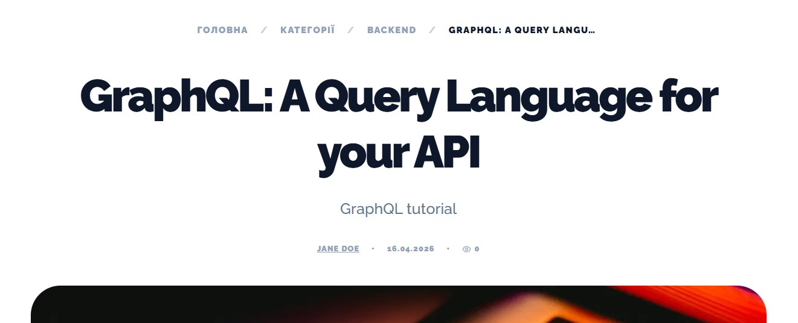
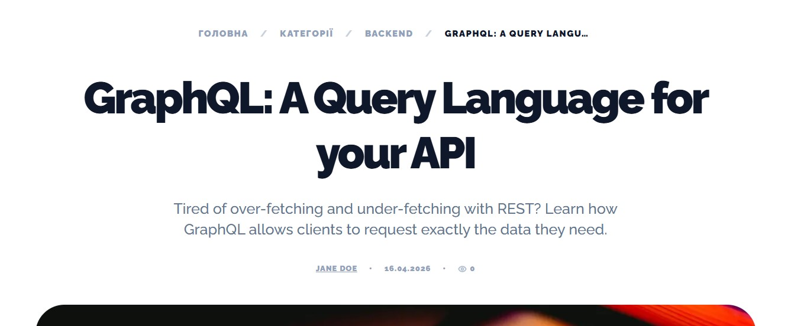

# Лабораторна робота №7. Поведінкові фактори та UX, Вебаналітика та SEO-стратегія
**Мета:** Навчитись оцінювати SEO-ефективність сайту через поведінкові та аналітичні дані: проводити UX-аудит сторінок входу, аналізувати CTR/Bounce/Engagement/Dwell-патерни, коректно налаштовувати GA4 події та конверсії, виконувати фінальний SEO-аудит проєкту з пріоритезацією задач у roadmap.

---

## 1. UX-аудит сайту

### 1.2 UX-чекліст першого екрана
| URL | Match між Title/H1/intent | Чітка цінність за 3-5 с | Помітний CTA | Елементи довіри | Mobile UX | Висновок |
|-----|---------------------------|-------------------------|--------------|-----------------|-----------|----------|
| / | Частково | Ні | Так | Ні | Не видно меню, невеликий горизонтальний скрол | Додати Hero-текст про блог; Працювати над мобільною версією |
| /about | Так | Так | Так | Ні | Горизонтальний скрол, немає меню | Додати блок "Наша команда"; Працювати над мобільною версією |
| /categories | Так | Так | Так | Ні | Горизонтальний скрол, немає меню | Впровадити іконки та яскраві кнопки "Перейти"; Працювати над мобільною версією |
| /frontend/core-web-vitals-guide | Частково | Так | Ні | Так | Горизонтальний скрол, немає меню | Створити чіткий Summary на початку; Працювати над мобільною версією  |
| /backend/nestjs-rest-api-tutorial| Частково | Так | Ні | Так | Горизонтальний скрол, немає меню | Створити чіткий Summary на початку; Працювати над мобільною версією |
| /categories/backend | Так | Так | Так | Ні | Горизонтальний скрол, немає меню | Працювати над мобільною версією |

### 1.3 Пошук UX-проблем, що впливають на SEO
| № | URL | Проблема | Категорія | Вплив на SEO | Severity | Гіпотеза виправлення |
|---|-----|----------|-----------|--------------|----------|----------------------|
| 1 | / | Горизонтальна прокрутка на мобільних | Usability | Низький CLS | High | Перевірити ширину контейнерів, прибрати фіксовані `px` |
| 2 | / | Відсутність Hero-тексту | Relevance | Робот не розуміє головну тему сайту | High | Додати заголовок із ключовими словами про блог |
| 3 | / | Приховане меню навігації на мобільних | Navigation | Збільшення Bounce Rate | High | Додати бургер-меню |
| 4 | / | Захована опція переходу на сторінку "Про нас" на мобільних | Navigation | Збільшення Bounce Rate | High | Додати бургер-меню або винести як окремий елемент у header |
| 5 | /categories | Відсутність візуальної ваги категорій | Usability | Низький CTR внутрішніх переходів | Low | Додати іконки та яскраві кнопки "Перейти" |
| 6 | /frontend/core-web-vitals-guide | Відсутність короткого змісту | Relevance | Короткий час перебування | Low | Додати короткий але змістовний опис статті на першому екрані |
| 7 | /frontend/core-web-vitals-guide | Дрібне посилання в тексті статті | Usability | Складність переходу за посиланням | Medium | Збільшити Tap Targets та міжрядковий інтервал |
| 8 | /uncategorized/mastering-typescript-generics | Неоптимізований URL-шлях | Relevance | Погана структура для роботів | High | Додати валідацію обов'язкової категорії при створенні та редагуванні статі |
| 9 | /admin/dashboard | Кнопка вилазить за межі блоку на мобільних | Usability | Низький CLS | High | Працювати над мобільною версією сайту |
| 10 | /admin/articles | Елементи налазять один на одного на мобільних | Usability | Збільшення Bounce Rate | High | Працювати над мобільною версією сайту |
| 11 | /admin/articles/new | Забагато елементів на одному екрані на мобільних | Usability | Низький CLS | Medium | Працювати над мобільною версією сайту |
| 12 | /admin/articles/new | Неоптимізовано розмір шрифта на мобільних | Usability | Низький CLS | High | Працювати над мобільною версією сайту |

---

## 2. Аналіз поведінкових показників

### 2.1 GSC аналіз (до кліку) - Мінімум 30 запитів
| Query/URL | Сегмент (brand/non-brand, mob/desk, info/com) | Impressions | Clicks | CTR | Avg position | Тренд (MoM) | Висновок |
|-----------|------------------------------------------------|-------------|--------|-----|--------------|-------------|----------|
| react hooks | non-brand / mobile / info | 12400 | 496 | 4.0% | 6.2 | +12% clicks | Є потенціал для росту |
| [Заповнити ще 29+ рядків...] |

### 2.2 GA4 аналіз (після кліку)
| Landing page | Organic sessions | Engaged sessions | Engagement rate | Avg eng. time | Key events | Conversion rate | Висновок |
|--------------|------------------|------------------|-----------------|---------------|------------|-----------------|----------|
| /example-1 | 540 | 318 | 58.9% | 01:42 | scroll_75, view_pricing | 2.6% | Слабкий перехід у ліди |
| [Заповнити для пріоритетних сторінок...] |

### 2.3 Bounce і dwell context-аналіз
| URL | Тип intent | Bounce/engagement контекст | Dwell-патерн | Нормально чи ризик | Що робити |
|-----|------------|----------------------------|--------------|--------------------|-----------|
| /faq | Інфо | Bounce високий, але 78% скрол | Довгий | Нормально | Додати блок "Наступний крок" |
| [Заповнити інші сторінки...] |

### 2.4 Мікроконверсії як ранні SEO-сигнали (Мінімум 5)
| Мікроконверсія | Event name | Де тригериться | Навіщо для SEO | Поточне значення | Ціль на 30 днів |
|----------------|------------|----------------|----------------|------------------|-----------------|
| Скрол 75% | scroll_75 | /articles/* | Підтверджує якість контенту | 41% сесій | 55% сесій |
| [Заповнити ще 4 рядки...] |

---

### 3. Налаштування GA4

#### 3.1 - Базова структура вимірювання

Таблиця контролю:

| Налаштування | Статус | Доказ | Коментар |
|--------------|--------|-------|----------|
| GA4 property створено та збір даних активний | OK |  | Data stream  активний |
| Фільтрація внутрішнього трафіку | ОК | | Активний |
| Єдині UTM-правила для test campaign | ОК | | Налаштовано |

#### 3.2 - Події для SEO-оцінки (через GTM або код)

Реалізувати мінімум **6 подій**, серед них обов'язково:

- `scroll_75`
- `view_search_results` (якщо є внутрішній пошук)
- `click_cta_primary`
- `form_start` або `generate_lead`
- `form_submit` або `purchase`
- `click_related_article`

Таблиця **"GA4 Event Mapping"**:

| Event name | Trigger | Parameters | Бізнес/SEO сенс | Перевірка в DebugView |
|------------|---------|------------|------------------|-----------------------|
| click_cta_primary | Клік по головній кнопці hero | page_type, intent_type, cta_label | Чи рухається користувач до цілі після входу з органіки | Event видно з параметрами |
| ... | | | | |

#### 3.3 - Налаштування conversions і аудиторій

1. Позначити мінімум **2 ключові conversion events**
2. Створити мінімум **3 аудиторії**:
   - Organic Engaged Users
   - Organic Non-Engaged
   - Organic Returning Users

Таблиця:

| Тип | Назва | Умова | Навіщо |
|-----|-------|-------|--------|
| Conversion | form_submit | event_name = form_submit | Оцінка внеску SEO у ліди |
| ... | | | |

#### 3.4 - Щотижневий GA4 SEO report

Сформувати короткий шаблон щотижневого звіту:

| KPI | Поточне значення | Минулого тижня | Delta | Порог тривоги | Дія |
|-----|------------------|----------------|-------|---------------|-----|
| Organic sessions | 2380 | 2210 | +7.7% | -10% WoW | Продовжити тест CTA на категоріях |
| ... | | | | | |

---

## 4. Фінальний SEO-аудит проєкту

### 4.1 Інтегрований audit backlog (Мінімум 12 задач)
| Issue | Evidence | Impact | Effort | Owner | Deadline | Success criteria |
|-------|----------|--------|--------|-------|----------|------------------|
| Низький CTR non-brand | GSC: CTR 2.1% при позиції 4 | +180 кліків/міс | M | SEO | 2026-05-05 | CTR +0.8 п.п. |
| [Заповнити ще 11+ рядків...] |

### 4.2 Пріоритезація та Впроваджені Quick Wins
**Матриця пріоритезації:**
* **Quick Wins:** Додати Hero-текст на головну сторінку, Оновити опис статті, Додати кількість переглядів статті
* **Strategic:** Змінити структуру URL (прибрати uncategorized), Додати бургер-меню, Мобільна версія адмін-панелі, Прибрати горизонтальний скрол на Mobile
* **Fill-ins:** Додати посилання на соцмережі в футер, Додати іконки до категорій, Замінити колір кнопок на яскравіший
* **Postpone:** Створити сторінку "Наші редактори", Впровадити темну тему для блогу

**ВПРОВАДЖЕНІ QUICK WINS:**
1. **Додати Hero-текст на головну сторінку**
   * Було:
     
   * Стало:
     
   
2. **Додати кількість переглядів статті**
   * Було:
     
   * Стало:
     
   
3. **Оновити опис статті**
   * Було:
     
   * Стало:
     
   

### 4.3 SEO roadmap на 30/60/90 днів
| Період | Ціль | Ключові задачі | KPI | Ризики |
|--------|------|----------------|-----|--------|
| Day 1-30 | Виправлення критичних багів | Імплементація Quick Wins | Ріст CTR на 1% | Затримка розробки |
| Day 31-60 | Розширення семантики | Створення нових landing pages | Ріст Impressions | Неякісний контент |
| Day 61-90 | Конверсійна оптимізація (CRO) | A/B тести CTA та форм | Ріст Lead CR | Падіння трафіку |

### 4.4 Executive summary (Управлінський висновок)
1. **Топ-5 проблем, що стримують SEO:** [Перелік]
2. **Топ-3 задачі для швидкого ефекту:** [Перелік]
3. **Задачі довгого циклу (60-90 днів):** [Перелік]
4. **KPI для контролю (тиждень/місяць/квартал):** [Перелік]

---

## 5. Відповіді на контрольні питання

### Рівень 1 - Розуміння термінів
1. **Чим відрізняються дані `до кліку` (GSC) і `після кліку` (GA4)...**
   * Google Search Console показує, що робить людина до того, як зайшла на сайт: що вона гуглила, скільки разів бачила твоє посилання і чи натиснула на нього. Google Analytics 4 показує, що людина робить після того, як зайшла: які кнопки натискає, скільки часу читає і чи купує щось.
2. **Чому високий Bounce Rate не завжди означає поганий UX?**
   * Уявіть, що ви шукаєте у пошуковику "як зварити яйце". Ви заходите на сайт, одразу бачите "варити 10 хвилин", закриваєте сторінку і йдете варити яйця. Це відмова, але ви знайшли те, що треба. Для статей чи швидких відповідей це абсолютно нормально.
3. **Що таке Dwell Time і як він пов'язаний із pogo-sticking?**
   * Dwell Time (Час затримки) — це час, який ти проводиш на сайті, перш ніж повернутися назад у Google. Якщо сайт поганий, ти одразу повертаєшся в пошук і клікаєш на інший сайт. Це швидке стрибання туди-сюди називається pogo-sticking. Google бачить це і опускає поганий сайт нижче.
4. **Які події в GA4 є критичними для SEO-оцінки landing pages?**
   * Scroll_75 — показує, що статтю реально читають, а не просто відкрили
   * Click_cta — показує, що людина зацікавилась і хоче дізнатися більше.
   * Form_submit — людина залишила свої контакти.
5. **Навіщо сегментувати дані на brand/non-brand і mobile/desktop?**
   * Люди, які шукають твій сайт по назві, вже тебе знають. Ті, хто шукають загальні речі — це нові люди. Їх треба вивчати окремо. Так само телефон і комп'ютер — це різні екрани, і якщо на телефоні сайт кривий, ми маємо побачити цю проблему окремо.

### Рівень 2 - Аналіз
6. **У сторінки CTR 2.4% при позиції 4.8 і 20 000 показів. Які 3 гіпотези...**
   * Поганий Title (Заголовок) — можливо, він нудний і не привертає увагу людей.
   * Відсутній Snippet (Опис у пошуку) — можливо, Google показує некрасивий шматок тексту під заголовком.
   * Intent (Намір пошуку) — можливо, люди шукають відео, а у нас текст, тому вони не хочуть клікати.
7. **Non-brand кліки ростуть, але lead CR із органіки падає. Які причини...**
   * Люди приходять за простою інформацією (почитати), а не купувати.
   * Зламана реєстрація (треба перевірити події помилок в аналітиці).
    * Кнопка Call to Action (Заклик до дії) непомітна або не працює.
8. **На mobile engagement rate суттєво нижчий, ніж на desktop. Як визначити...**
   * Треба подивитися, на якій секунді люди йдуть геть з мобільного. Якщо вони тікають у перші 3-5 секунд, значить, перший екран вантажиться дуже довго (поганий LCP) або на ньому все розпливається (поганий CLS), і текст просто не влазить в екран телефону.
9. **Які ризики виникають, якщо conversion events у GA4 налаштовані без...**
   * Це як записувати рецепти різними мовами і без мір ваги. Якщо ми назвемо одну кнопку "click_btn", а іншу "button_click", ми не зможемо зібрати їх в один загальний звіт. Ми просто заплутаємось, що і де люди натискали.
10. **Як інтерпретувати ситуацію: високий scroll depth, але низький клік по CTA?**
    * Люди читають статтю до кінця, бо вона цікава. Але вони нічого не купують, бо ми їм погано запропонували. Кнопка або зливається з фоном, або стоїть не в тому місці, або текст на ній нецікавий ("Натисни" замість "Отримати безкоштовно").

### Рівень 3 - Синтез та висновки
11. **Складіть власний топ-5 SEO-задач у форматі Impact/Effort...**
    * Fix Core Web Vitals (Виправити базові показники сайту) — Високий вплив, Середні зусилля (зробити так, щоб сайт вантажився швидко, як ми робили з картинками).
    * Add Meta Tags (Додати метатеги) — Високий вплив, Низькі зусилля (швидко написати гарні заголовки для Google).
    * Internal Linking (Внутрішня перелінковка) — Середній вплив, Низькі зусилля (додати посилання між статтями, щоб люди не йшли з блогу).
    * Microdata Schema.org (Мікророзмітка) — Середній вплив, Середні зусилля (додати спеціальний код, щоб у пошуку з'явилися красиві картки).
    * Create new Landing Pages (Створити нові цільові сторінки) — Високий вплив, Високі зусилля (треба багато писати і створювати нові розділи).
12. **Запропонуйте систему щотижневого SEO-review...**
    * Clicks (Кліки з пошуку) — контролює СЕО-спеціаліст.
    * Engagement Rate (Показник залученості) — контролює UX Дизайнер.
    * PageSpeed Insights Score (Швидкість сторінки) — контролює Фронтенд розробник.
13. **Опишіть, як ви доведете бізнесу ефект від UX-оптимізації...**
    * Покажемо ріст Conversion Rate (Показника конверсії) та збільшення прибутку без витрат на рекламу.
14. **Сформуйте SMART-ціль на 90 днів для non-brand органічного трафіку...**
    * Ціль: збільшити кількість кліків за загальними запитами (наприклад, "як вивчити react") з 500 до 800 на місяць до кінця наступного кварталу.
    * Як перевіримо: зайдемо в Google Search Console, відфільтруємо всі запити, де немає слова "Blog.IT", і подивимося, чи досягла цифра відмітки 800 кліків.
